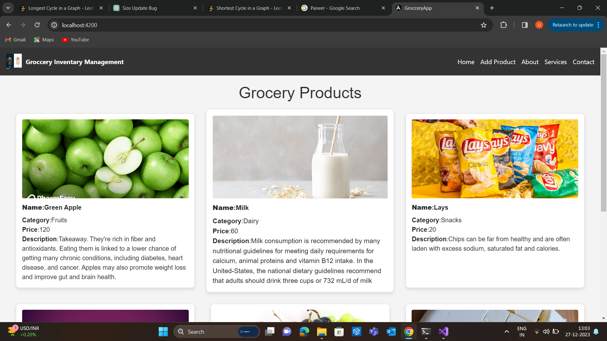
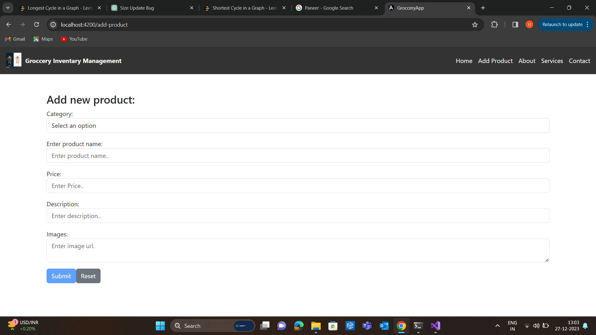
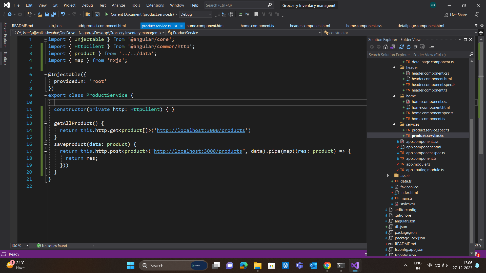

# GrocceryApp

This project was generated with [Angular CLI](https://github.com/angular/angular-cli) version 16.2.10.

# Angular Project with JSON Server

## Description

This is a simple Angular project that demonstrates integration with a JSON Server to provide a fake REST API for development purposes.

## Installation

1. Clone the repository.
2. Run `npm install` to install project dependencies.
3. Run `npm install -g json-server` to install the JSON Server globally.

## Usage

1. Start the Angular development server: `ng serve`.
2. Start the JSON Server: `json-server --watch db.json --port 3000`.
3. Access the Angular app at `http://localhost:4200`.
4. Access the JSON Server API at `http://localhost:3000`.

## JSON Server

The project uses `json-server` to simulate a RESTful API. The `db.json` file contains sample data.

### Endpoints

- Products: `http://localhost:3000/products`

### Sample Data

```json
{
  "products": [
    { "id": 1, "name": "Product A", "price": 19.99 },
    { "id": 2, "name": "Product B", "price": 29.99 },
    { "id": 3, "name": "Product C", "price": 39.99 }
  ]
}





